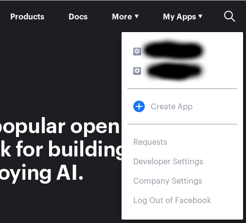
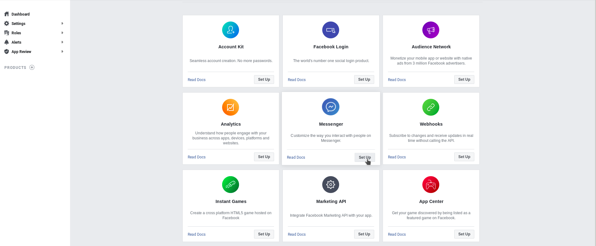
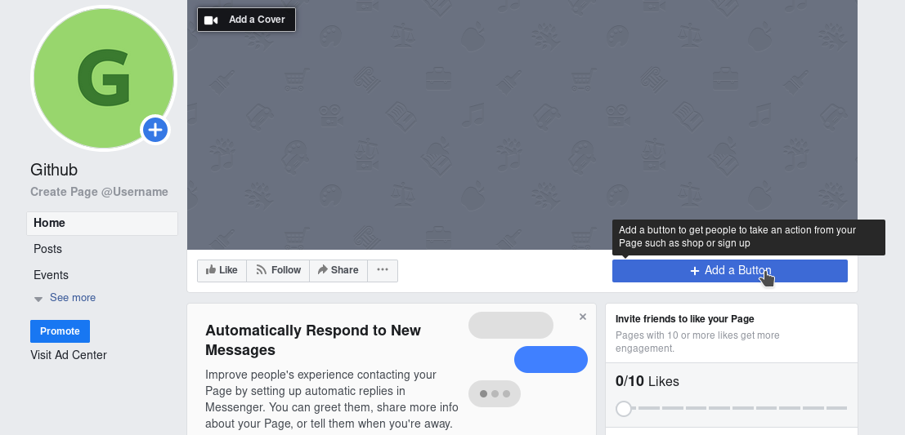
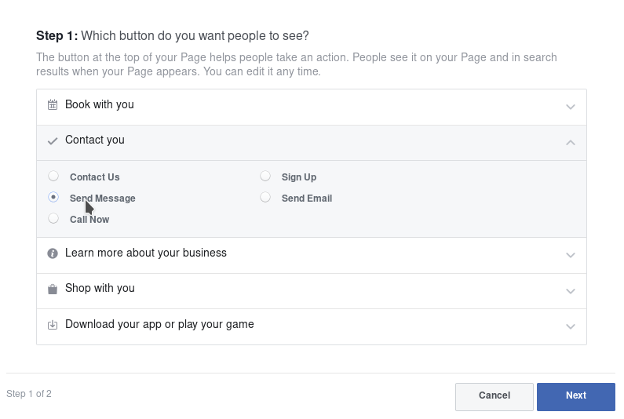
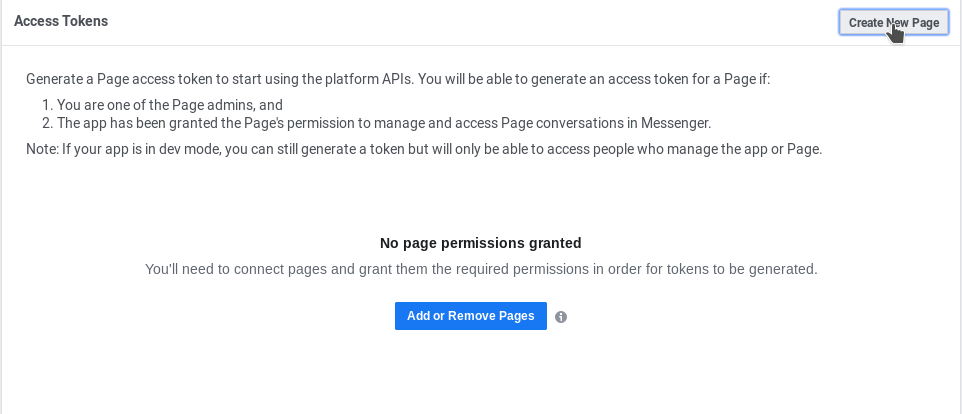
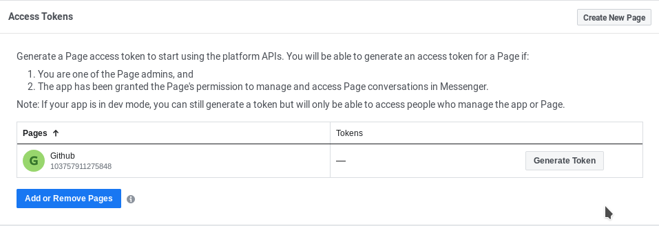
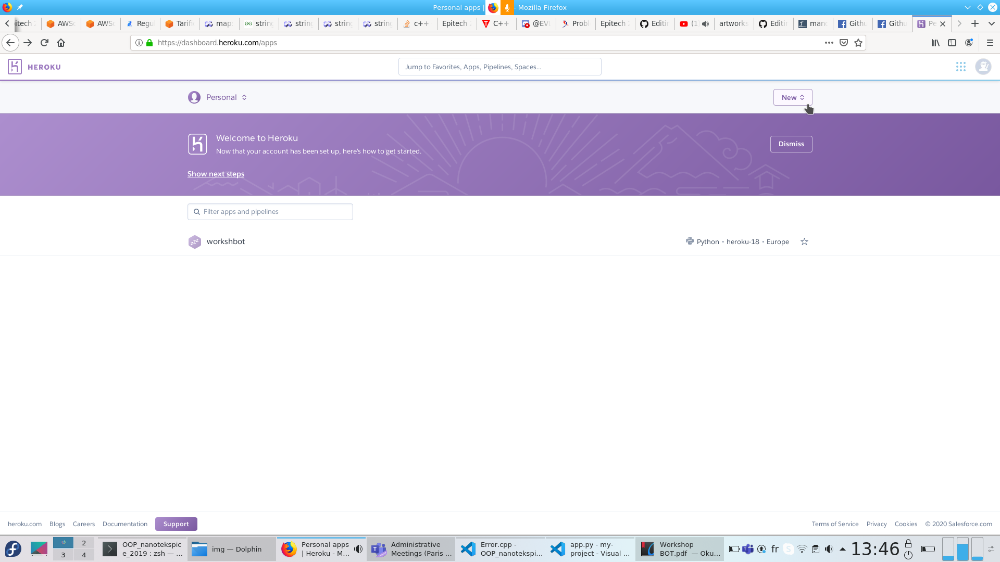
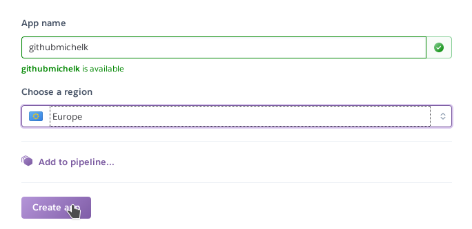
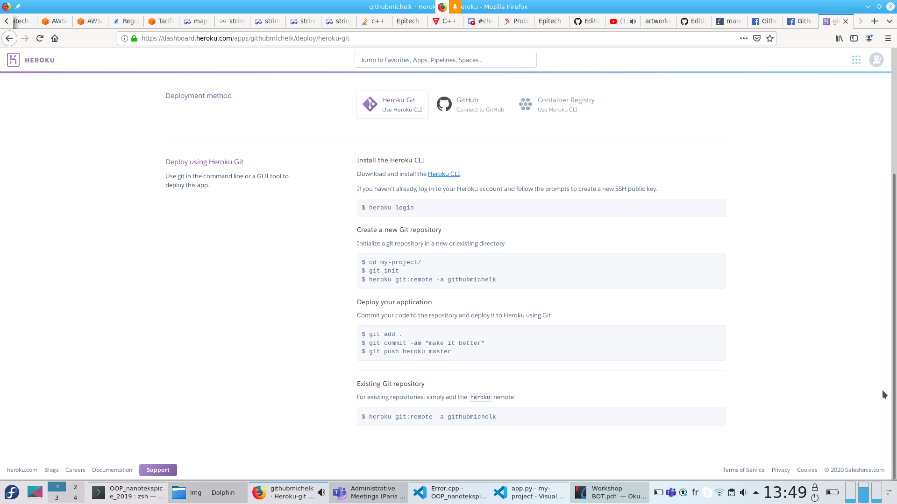

# Bot_messenger

# Mandatory pre-requisite :
- Facebook account  
- Heroku account  
- Python   
- Git  

# Download this repo

# Configure Facebook Account :
- Go <a href="https://developers.facebook.com/"> here </a>. Facebook for developpers.  
- Connect with your Facebook account.  
- Create a new APP.  
  
- Enter your App name  
- Configure your messenger bot:  
  
- Create your facebook page : 
  

# Configure your Facebook Page:
- Enter your page Name  
- In category choose Software  
- Click on "Add button"  
  
- Go to "Contact us" and add send message  
  
- Add messenger and Finish configuration

# Connect your Facebook Page to your Developper account :
- Click on Add or Remove Pages (on developper.facebook.com)  
  
- Add your page and just press continue (don't worry if there's an error).  
- Then you should have a page with your page :  
  
- Generate your token  
- Paste your token somewhere you don't lose it 

# Configure Heroku
- Go to <a href="https://www.heroku.com"> heroku.com </a>  
- Create your account  
- Once you've created your account create a new app  
  
  
- Download the <a href="https://devcenter.heroku.com/articles/heroku-cli">Heroku CLI </a>  
- Then follow the differents commands :  
  
